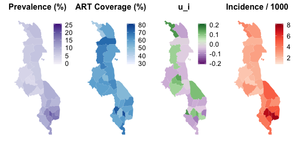

<!-- README.md is generated from README.Rmd. Please edit that file -->

# hivmappr

The package `hivmappr` implements a basic small-area model for
estimating subnational adult HIV prevalence, ART coverage, and HIV
incidence.

This README provides an example of the `hivmappr` workflow using
**simulated** subnational data consistent with national-level estimates
from the [2016 Malawi Population HIV Impact Assessment
(MPHIA)](http://phia.icap.columbia.edu/countries/malawi/) survey.

## Installation

Install the development version of `hivmappr` from
[GitHub](https://github.com/) with:

``` r
# install.packages("devtools")
devtools::install_github("mrc-ide/hivmappr@shiny")
```

## Shiny interface

After installation, to launch the shiny interface:

``` r
library(hivmappr)
run_hivmappr()
```

This is still under development and presently simply shows a demo of the
workflow.

## Example

This is a basic example of an `hivmappr` workflow using simulated data
from Malawi. Example datasets are stored in the
[`inst/extdata`](https://github.com/mrc-ide/hivmappr/tree/master/inst/extdata)
directory.

#### 0\. Load packages

Load `hivmappr`.

``` r
library(hivmappr)
#> Loading required package: Rcpp
#> Loading required package: rhandsontable
#> Loading required package: maps
#> Loading required package: mapproj
#> Loading required package: ggplot2
#> Loading required package: ggridges
#> 
#> Attaching package: 'ggridges'
#> The following object is masked from 'package:ggplot2':
#> 
#>     scale_discrete_manual
#> Loading required package: gridExtra
```

Load other packages for analysis.

``` r
library(sf)
library(sp)
library(magrittr)
library(rstan)
library(data.table)
library(abind)

library(ggplot2)
library(ggridges)
library(gridExtra)
```

#### 1\. Load a shapefile

Shapefile is from the [DHS Spatial Data
Repository](https://spatialdata.dhsprogram.com/boundaries/#view=map&countryId=MW&surveyId=483&level=2).

``` r
sh <- read_sf(system.file("extdata", "mwsh", package="hivmappr")) %>% as_Spatial
plot(sh)
```


#### 2\. Load data and merge with shapefile

Dataset consists of district-level estimates of:

  - Adult population size
  - Household survey prevalence and RITA results
  - Number of adults receiving ART
  - ANC-RT data about HIV status and ART status prior to pregnancy

<!-- end list -->

``` r
df <- read.csv(system.file("extdata", "mwdf.csv", package="hivmappr"))
mw <- merge(sh, df)
```

#### 3\. Basic data visualization and checks

*TO BE COMPLETED*

#### 4\. Fit the model

Prepare data for Stan model input

``` r
data <- with(mw@data, list(N_reg = length(district),
                           district = district,
                           prev_est = prev_survey,
                           prev_se = prev_survey_se,
                           anc1_obs = cbind(ancrt_neg = ancrt_n - ancrt_pos,
                                            ancrt_noart=ancrt_pos - ancrt_art,
                                            ancrt_art=ancrt_art),
                           P_i = npos,
                           R_i = nrecent,
                           pop15pl_i = pop15pl,
                           pop15to49_i = pop15to49,
                           art15pl_i = adultart,
                           prev_ratio = 1.06,
                           OmegaT0 = 130 / 365,
                           sigma_OmegaT = ((142-118)/365)/(2*qnorm(0.975)),
                           betaT0 = 0.0,
                           sigma_betaT = 0.00001,
                           omega = 0.7,
                           T = 1.0,
                           Nkappa = 1,
                           Xkappa = matrix(10, length(district), 1),
                           sigma_u_sd = 1))
```

Fit the stan model.

``` r
fit <- sampling(hivmappr:::stanmodels$incidence_rita,
                data=data,
                control = list(adapt_delta = 0.95))
#> 
#> SAMPLING FOR MODEL 'incidence_rita' NOW (CHAIN 1).
#> Rejecting initial value:
#>   Error evaluating the log probability at the initial value.
#> Exception: binomial_lpmf: Probability parameter[1] is -0.0322892, but must be in the interval [0, 1]  (in 'model_incidence_rita' at line 145)
#> 
#> Rejecting initial value:
#>   Error evaluating the log probability at the initial value.
#> Exception: binomial_lpmf: Probability parameter[1] is -2023.53, but must be in the interval [0, 1]  (in 'model_incidence_rita' at line 145)
#> 
#> Rejecting initial value:
#>   Error evaluating the log probability at the initial value.
#> Exception: binomial_lpmf: Probability parameter[1] is 3.05437e+11, but must be in the interval [0, 1]  (in 'model_incidence_rita' at line 145)
#> 
#> Rejecting initial value:
#>   Error evaluating the log probability at the initial value.
#> Exception: binomial_lpmf: Probability parameter[1] is 1.60281e+06, but must be in the interval [0, 1]  (in 'model_incidence_rita' at line 145)
#> 
#> 
#> Gradient evaluation took 0.000382 seconds
#> 1000 transitions using 10 leapfrog steps per transition would take 3.82 seconds.
#> Adjust your expectations accordingly!
#> 
#> 
#> Iteration:    1 / 2000 [  0%]  (Warmup)
#> Iteration:  200 / 2000 [ 10%]  (Warmup)
#> Iteration:  400 / 2000 [ 20%]  (Warmup)
#> Iteration:  600 / 2000 [ 30%]  (Warmup)
#> Iteration:  800 / 2000 [ 40%]  (Warmup)
#> Iteration: 1000 / 2000 [ 50%]  (Warmup)
#> Iteration: 1001 / 2000 [ 50%]  (Sampling)
#> Iteration: 1200 / 2000 [ 60%]  (Sampling)
#> Iteration: 1400 / 2000 [ 70%]  (Sampling)
#> Iteration: 1600 / 2000 [ 80%]  (Sampling)
#> Iteration: 1800 / 2000 [ 90%]  (Sampling)
#> Iteration: 2000 / 2000 [100%]  (Sampling)
#> 
#>  Elapsed Time: 5.09505 seconds (Warm-up)
#>                2.63233 seconds (Sampling)
#>                7.72738 seconds (Total)
#> 
#> 
#> SAMPLING FOR MODEL 'incidence_rita' NOW (CHAIN 2).
#> Rejecting initial value:
#>   Error evaluating the log probability at the initial value.
#> Exception: binomial_lpmf: Probability parameter[1] is -846.742, but must be in the interval [0, 1]  (in 'model_incidence_rita' at line 145)
#> 
#> Rejecting initial value:
#>   Error evaluating the log probability at the initial value.
#> Exception: binomial_lpmf: Probability parameter[1] is 46970.4, but must be in the interval [0, 1]  (in 'model_incidence_rita' at line 145)
#> 
#> Rejecting initial value:
#>   Error evaluating the log probability at the initial value.
#> Exception: binomial_lpmf: Probability parameter[1] is -959.267, but must be in the interval [0, 1]  (in 'model_incidence_rita' at line 145)
#> 
#> Rejecting initial value:
#>   Error evaluating the log probability at the initial value.
#> Exception: binomial_lpmf: Probability parameter[1] is 1.96301e+06, but must be in the interval [0, 1]  (in 'model_incidence_rita' at line 145)
#> 
#> Rejecting initial value:
#>   Error evaluating the log probability at the initial value.
#> Exception: binomial_lpmf: Probability parameter[3] is 16.3559, but must be in the interval [0, 1]  (in 'model_incidence_rita' at line 145)
#> 
#> Rejecting initial value:
#>   Error evaluating the log probability at the initial value.
#> Exception: binomial_lpmf: Probability parameter[1] is -6.17799e+06, but must be in the interval [0, 1]  (in 'model_incidence_rita' at line 145)
#> 
#> 
#> Gradient evaluation took 5.2e-05 seconds
#> 1000 transitions using 10 leapfrog steps per transition would take 0.52 seconds.
#> Adjust your expectations accordingly!
#> 
#> 
#> Iteration:    1 / 2000 [  0%]  (Warmup)
#> Iteration:  200 / 2000 [ 10%]  (Warmup)
#> Iteration:  400 / 2000 [ 20%]  (Warmup)
#> Iteration:  600 / 2000 [ 30%]  (Warmup)
#> Iteration:  800 / 2000 [ 40%]  (Warmup)
#> Iteration: 1000 / 2000 [ 50%]  (Warmup)
#> Iteration: 1001 / 2000 [ 50%]  (Sampling)
#> Iteration: 1200 / 2000 [ 60%]  (Sampling)
#> Iteration: 1400 / 2000 [ 70%]  (Sampling)
#> Iteration: 1600 / 2000 [ 80%]  (Sampling)
#> Iteration: 1800 / 2000 [ 90%]  (Sampling)
#> Iteration: 2000 / 2000 [100%]  (Sampling)
#> 
#>  Elapsed Time: 4.49742 seconds (Warm-up)
#>                3.17305 seconds (Sampling)
#>                7.67047 seconds (Total)
#> 
#> 
#> SAMPLING FOR MODEL 'incidence_rita' NOW (CHAIN 3).
#> 
#> Gradient evaluation took 5e-05 seconds
#> 1000 transitions using 10 leapfrog steps per transition would take 0.5 seconds.
#> Adjust your expectations accordingly!
#> 
#> 
#> Iteration:    1 / 2000 [  0%]  (Warmup)
#> Iteration:  200 / 2000 [ 10%]  (Warmup)
#> Iteration:  400 / 2000 [ 20%]  (Warmup)
#> Iteration:  600 / 2000 [ 30%]  (Warmup)
#> Iteration:  800 / 2000 [ 40%]  (Warmup)
#> Iteration: 1000 / 2000 [ 50%]  (Warmup)
#> Iteration: 1001 / 2000 [ 50%]  (Sampling)
#> Iteration: 1200 / 2000 [ 60%]  (Sampling)
#> Iteration: 1400 / 2000 [ 70%]  (Sampling)
#> Iteration: 1600 / 2000 [ 80%]  (Sampling)
#> Iteration: 1800 / 2000 [ 90%]  (Sampling)
#> Iteration: 2000 / 2000 [100%]  (Sampling)
#> 
#>  Elapsed Time: 4.5774 seconds (Warm-up)
#>                3.25214 seconds (Sampling)
#>                7.82954 seconds (Total)
#> 
#> 
#> SAMPLING FOR MODEL 'incidence_rita' NOW (CHAIN 4).
#> 
#> Gradient evaluation took 5.8e-05 seconds
#> 1000 transitions using 10 leapfrog steps per transition would take 0.58 seconds.
#> Adjust your expectations accordingly!
#> 
#> 
#> Iteration:    1 / 2000 [  0%]  (Warmup)
#> Iteration:  200 / 2000 [ 10%]  (Warmup)
#> Iteration:  400 / 2000 [ 20%]  (Warmup)
#> Iteration:  600 / 2000 [ 30%]  (Warmup)
#> Iteration:  800 / 2000 [ 40%]  (Warmup)
#> Iteration: 1000 / 2000 [ 50%]  (Warmup)
#> Iteration: 1001 / 2000 [ 50%]  (Sampling)
#> Iteration: 1200 / 2000 [ 60%]  (Sampling)
#> Iteration: 1400 / 2000 [ 70%]  (Sampling)
#> Iteration: 1600 / 2000 [ 80%]  (Sampling)
#> Iteration: 1800 / 2000 [ 90%]  (Sampling)
#> Iteration: 2000 / 2000 [100%]  (Sampling)
#> 
#>  Elapsed Time: 4.94276 seconds (Warm-up)
#>                2.70122 seconds (Sampling)
#>                7.64398 seconds (Total)
#> Warning: There were 6 divergent transitions after warmup. Increasing adapt_delta above 0.95 may help. See
#> http://mc-stan.org/misc/warnings.html#divergent-transitions-after-warmup
#> Warning: Examine the pairs() plot to diagnose sampling problems
```

#### 5\. Display estimates

Map of posterior mean estimates.

``` r
## extract summary estimates 

est <- summary(fit, c("rho_i", "alpha_i", "u_i", "lambda_i", "infections_i"))$summary[, "mean"]
est <- data.table(param = names(est), value=est)
est$district_idx <- as.integer(sub(".*\\[([0-9]+)\\]", "\\1", est$param))
est$district <- factor(mw$district[est$district_idx], data$district)
est$region <- factor(mw$region[est$district_idx], c("Northern", "Central", "Southern"))
est$param <- sub("([^\\[]+).*", "\\1", est$param)


## Extract map polygon data 
mwpoly <- map_data(mw, namefield="district")

th <- function(title)
  list(geom_map(aes(fill = value), map = mwpoly),
       expand_limits(x = mwpoly$long, y = mwpoly$lat),
       labs(x = NULL, y = NULL, title=title),
       coord_map(),
       theme(axis.ticks = element_blank(),
             axis.text = element_blank(),
             panel.background = element_blank(),
             panel.border = element_blank(),
             legend.position=c(1, 1),
             legend.justification=c(0.5, 1),
             legend.background = element_rect(fill = NA),
             legend.key.size=unit(12, "points"),
             legend.text = element_text(size=10),
             plot.title=element_text(hjust=0.5, face="bold"),
             text = element_text(size=10)))

panA <- ggplot(est[param == "rho_i"], aes(map_id = district)) +
  scale_fill_distiller(element_blank(), palette="Purples", direction=1,
                       limits=c(0, 0.25), labels=function(x) round(100*x)) +
  th("Prevalence (%)")
panB <- ggplot(est[param == "alpha_i"], aes(map_id = district)) +
  scale_fill_distiller(element_blank(), palette="Blues", direction=1,
                       limits=c(0.3, 0.8), labels=function(x) round(100*x)) +
  th("ART Coverage (%)")
panC <- ggplot(est[param == "u_i"], aes(map_id = district)) +
  scale_fill_distiller(element_blank(), palette="PRGn", direction=1,
                       limits=c(-0.2, 0.2)) +
  th("u_i")
panD <- ggplot(est[param == "lambda_i"], aes(map_id = district)) +
  scale_fill_distiller(element_blank(), palette="Reds", direction=1,
                       limits=c(1, 8)/1e3, labels=function(x) round(1000*x)) +
  th("Incidence / 1000")  

grid.arrange(panA, panB, panC, panD, ncol=4)
#> Warning in seq.default(.limits[1], .limits[2], length = guide$nbin):
#> partial argument match of 'length' to 'length.out'

#> Warning in seq.default(.limits[1], .limits[2], length = guide$nbin):
#> partial argument match of 'length' to 'length.out'

#> Warning in seq.default(.limits[1], .limits[2], length = guide$nbin):
#> partial argument match of 'length' to 'length.out'

#> Warning in seq.default(.limits[1], .limits[2], length = guide$nbin):
#> partial argument match of 'length' to 'length.out'
```



Density plot of posterior district
estimates.

``` r
samp <- as.matrix(fit, c("rho_i", "alpha_i", "u_i", "lambda_i", "infections_i")) %>%
  abind(along=0)
#> Warning in seq.default(from = 1, len = along - 1): partial argument match
#> of 'len' to 'length.out'
#> Warning in seq.default(to = N - 1, len = N - along): partial argument match
#> of 'len' to 'length.out'
#> Warning in seq.default(len = N): partial argument match of 'len' to
#> 'length.out'
#> Warning in seq.default(along = arg.names): partial argument match of
#> 'along' to 'along.with'
#> Warning in seq.default(len = length(arg.list)): partial argument match of
#> 'len' to 'length.out'
#> Warning in seq.default(along = perm): partial argument match of 'along' to
#> 'along.with'

#> Warning in seq.default(along = perm): partial argument match of 'along' to
#> 'along.with'
#> Warning in seq.default(len = ncol(arg.dim)): partial argument match of
#> 'len' to 'length.out'
#> Warning in seq.default(len = N): partial argument match of 'len' to
#> 'length.out'
#> Warning in seq.default(along = arg.names): partial argument match of
#> 'along' to 'along.with'

#> Warning in seq.default(along = arg.names): partial argument match of
#> 'along' to 'along.with'
#> Warning in seq.default(len = length(arg.names)): partial argument match of
#> 'len' to 'length.out'
#> Warning in seq.default(along = perm): partial argument match of 'along' to
#> 'along.with'
names(dimnames(samp)) <- c("model", NA, "param")
samp <- melt(samp) %>% data.table
samp$district_idx <- as.integer(sub(".*\\[([0-9]+)\\]", "\\1", samp$param))
samp$district <- factor(mw$district[samp$district_idx],
                        rev(mw$district))
samp$region <- factor(mw$region[samp$district_idx], c("Northern", "Central", "Southern"))
samp$param <- sub("([^\\[]+).*", "\\1", samp$param)

th <- list(theme_minimal(),
           theme(plot.title=element_text(hjust=0.5, face="bold", size=8),
                 text = element_text(size=10),
                 aspect.ratio=2,
                 axis.text.y=element_blank(),
                 axis.ticks.y = element_line(),
                 axis.ticks.length = unit(2, "pt")))

panA <- ggplot(data=samp[param == "rho_i"],
               aes(x=value, y=district, fill = ..x.. )) +
  geom_density_ridges_gradient(rel_min_height=0.01) +
  geom_vline(xintercept=0.10, color="grey20", linetype="dashed") +
  scale_x_continuous(element_blank(), labels=function(x) round(100*x, 1)) +
  scale_y_discrete(element_blank()) +
  scale_fill_distiller(guide = "none", palette="Purples", direction=1, trans="log10") +
  labs(title="Prevalence (%)") +
  th + theme(axis.text.y=element_text(size=7, hjust=1))

panB <- ggplot(data=samp[param == "alpha_i"],
               aes(x=value, y=district, fill = ..x.. )) +
  geom_density_ridges_gradient(rel_min_height=0.01) +
  geom_vline(xintercept=0.51, color="grey20", linetype="dashed") +
  scale_x_continuous(element_blank(), labels=function(x) round(100*x, 1)) +
  scale_y_discrete(element_blank()) +
  scale_fill_distiller(guide = "none", palette="Blues", direction=1) +
  labs(title="ART Coverage (%)") +
  th

panC <- ggplot(data=samp[param == "lambda_i"],
       aes(x=value, y=district, fill = ..x.. )) +
  geom_density_ridges_gradient(rel_min_height=0.025) +
  geom_vline(xintercept=0.0036, color="grey20", linetype="dashed") +
  scale_x_log10(element_blank(),
                breaks=c(0.0005, 0.001, 0.002, 0.005, 0.01, 0.02),
                limits=c(0.0006, 0.025), labels=function(x) round(1000*x, 1)) +
  scale_y_discrete(element_blank()) +
  scale_fill_distiller(guide = "none", palette="Reds", direction=1) +
  labs(title="Incidence / 1000 (log)") +
  th

panD <- ggplot(data=samp[param == "infections_i"],
       aes(x=value, y=district, fill = ..x.. )) +
  geom_density_ridges_gradient(rel_min_height=0.025) +
  scale_x_log10(element_blank(), limits=c(50, 10000), labels=function(x) round(x)) +
  scale_y_discrete(element_blank()) +
  scale_fill_distiller(guide = "none", palette="Reds", direction=1) +
  labs(title="New infections", fontface="bold") +
  th

grid.arrange(panA, panB, panC, panD, ncol=4, widths=c(1.35, 1, 1, 1))
#> Picking joint bandwidth of 0.000975
#> Picking joint bandwidth of 0.00671
#> Picking joint bandwidth of 0.0293
#> Picking joint bandwidth of 0.0301
```


#### 6\. Table of estimates

``` r
est <- summary(fit, c("rho_i", "alpha_i", "lambda_i", "infections_i"))$summary[, c("mean", "2.5%", "97.5%")]
colnames(est) <- c("mean", "ci_l", "ci_u")
est <- data.table(param = rownames(est), est)
est$district_idx <- as.integer(sub(".*\\[([0-9]+)\\]", "\\1", est$param))
est$district <- factor(mw$district[est$district_idx], data$district)
est$region <- factor(mw$region[est$district_idx], c("Northern", "Central", "Southern"))
est$param <- sub("([^\\[]+).*", "\\1", est$param) %>% sub("\\_i$", "", .)
est$scale <- c(rho = 100, alpha = 100, lambda = 1000, infections = 1)[est$param]
est$digits <- c(rho = 1, alpha = 0, lambda = 1, infections = -2)[est$param]
est$str <- with(est, sprintf(paste0("%.", pmax(digits, 0), "f (%.", pmax(digits, 0), "f, %.", pmax(digits, 0), "f)"),
                             round(scale*mean, digits),
                             round(scale*ci_l, digits),
                             round(scale*ci_u, digits)))
est$label <- factor(est$param, c("rho", "alpha", "lambda", "infections"),
                    c("Prevalence (%)", "ART coverage (%)", "Incidence (per 1000)", "New infections"))

dcast(est, district+region ~ label, value.var="str") %>% knitr::kable()
```

| district   | region   | Prevalence (%)    | ART coverage (%) | Incidence (per 1000) | New infections    |
| :--------- | :------- | :---------------- | :--------------- | :------------------- | :---------------- |
| Chitipa    | Northern | 6.1 (5.1, 7.2)    | 44 (37, 53)      | 3.5 (1.2, 9.0)       | 400 (100, 1000)   |
| Karonga    | Northern | 7.6 (6.6, 8.7)    | 58 (51, 66)      | 2.9 (0.8, 6.1)       | 500 (100, 1000)   |
| Rumphi     | Northern | 6.2 (5.6, 7.1)    | 71 (62, 79)      | 2.2 (0.6, 4.8)       | 200 (100, 500)    |
| Nkhata Bay | Northern | 6.8 (5.9, 7.8)    | 59 (51, 67)      | 2.7 (0.8, 5.8)       | 300 (100, 700)    |
| Mzimba     | Northern | 5.9 (5.2, 6.7)    | 66 (58, 74)      | 2.4 (0.8, 5.3)       | 1300 (500, 2900)  |
| Likoma     | Northern | 8.3 (7.0, 9.7)    | 63 (53, 73)      | 3.3 (0.9, 7.5)       | 0 (0, 0)          |
| Nkhotakota | Central  | 5.9 (5.2, 6.8)    | 61 (53, 69)      | 2.3 (0.6, 4.8)       | 400 (100, 900)    |
| Kasungu    | Central  | 4.2 (3.7, 4.9)    | 56 (48, 64)      | 1.7 (0.4, 3.4)       | 600 (200, 1300)   |
| Ntchisi    | Central  | 3.8 (3.2, 4.4)    | 51 (43, 60)      | 2.0 (0.7, 5.4)       | 300 (100, 700)    |
| Dowa       | Central  | 3.3 (2.9, 3.9)    | 61 (52, 69)      | 1.5 (0.5, 3.6)       | 500 (200, 1300)   |
| Mchinji    | Central  | 4.9 (4.3, 5.6)    | 59 (52, 67)      | 1.9 (0.5, 4.1)       | 600 (100, 1200)   |
| Salima     | Central  | 6.4 (5.6, 7.2)    | 64 (56, 72)      | 2.5 (0.6, 5.2)       | 500 (100, 1000)   |
| Lilongwe   | Central  | 7.3 (6.4, 8.2)    | 59 (52, 67)      | 3.1 (1.3, 5.8)       | 3900 (1700, 7300) |
| Dedza      | Central  | 4.4 (3.8, 5.0)    | 58 (51, 66)      | 1.7 (0.5, 3.6)       | 600 (200, 1300)   |
| Ntcheu     | Central  | 8.0 (6.9, 9.2)    | 57 (50, 66)      | 3.2 (0.9, 6.3)       | 800 (200, 1600)   |
| Mangochi   | Southern | 9.9 (8.5, 11.2)   | 52 (46, 60)      | 4.8 (1.9, 10.4)      | 2100 (800, 4400)  |
| Machinga   | Southern | 8.6 (7.6, 9.6)    | 63 (56, 71)      | 3.2 (0.8, 6.6)       | 900 (200, 1800)   |
| Balaka     | Southern | 10.8 (9.4, 12.2)  | 59 (52, 67)      | 4.2 (1.1, 8.7)       | 700 (200, 1400)   |
| Zomba      | Southern | 12.6 (11.2, 14.0) | 58 (52, 65)      | 5.0 (1.6, 9.7)       | 1700 (600, 3400)  |
| Neno       | Southern | 10.1 (9.0, 11.4)  | 73 (65, 82)      | 3.4 (0.9, 7.6)       | 200 (100, 500)    |
| Mwanza     | Southern | 8.4 (7.4, 9.5)    | 63 (55, 71)      | 4.0 (1.4, 10.5)      | 200 (100, 600)    |
| Blantyre   | Southern | 14.8 (13.0, 16.5) | 50 (45, 57)      | 7.1 (3.3, 13.1)      | 4300 (2000, 7800) |
| Phalombe   | Southern | 14.5 (12.7, 16.4) | 61 (54, 70)      | 5.3 (1.3, 10.5)      | 900 (200, 1700)   |
| Chiradzulu | Southern | 18.9 (17.4, 20.8) | 75 (69, 82)      | 7.2 (2.5, 17.9)      | 1000 (300, 2500)  |
| Mulanje    | Southern | 16.6 (14.9, 18.5) | 53 (48, 59)      | 7.6 (3.0, 15.2)      | 1900 (800, 3800)  |
| Thyolo     | Southern | 14.6 (13.0, 16.3) | 60 (54, 67)      | 5.3 (1.3, 10.4)      | 1600 (400, 3200)  |
| Chikwawa   | Southern | 10.0 (8.5, 11.6)  | 57 (49, 67)      | 4.0 (1.0, 8.3)       | 900 (200, 1900)   |
| Nsanje     | Southern | 12.3 (11.1, 13.7) | 67 (60, 75)      | 4.3 (1.1, 9.0)       | 500 (100, 1100)   |
